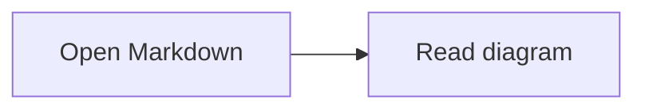

# Markdown Viewer

A focused reader for local Markdown files. Open multiple documents, move between them from the sidebar, and read rendered content with syntax highlighting and automatic light/dark theme support. Available on the web and as a desktop app.

## Requirements

- **Node** 22.12+ and **pnpm** 11.24.0
- **Rust toolchain** (stable) — only for Tauri commands; the Vite app works without it.
- **Platform-specific dependencies** — [Tauri prerequisites](https://v2.tauri.app/start/prerequisites/) (MSVC Build Tools on Windows, WebKitGTK on Linux, Xcode CLT on macOS).

## Install

```sh
pnpm install
```

## Web (Vite only)

```sh
pnpm dev          # start dev server at http://localhost:5173
pnpm build        # production build into dist/
pnpm preview      # serve the production build locally
pnpm lint         # run ESLint
pnpm test         # run frontend tests once
pnpm test:watch   # rerun frontend tests while developing
pnpm test:coverage # generate a coverage report
```

## Desktop (Tauri)

```sh
pnpm tauri:dev    # launches Vite + compiles Rust + opens the desktop window
pnpm tauri:build  # produces the platform installer (.msi/.exe/.dmg/.AppImage)
pnpm tauri        # raw Tauri CLI passthrough (e.g. pnpm tauri info)
```

`tauri:dev` runs `pnpm dev` automatically via `beforeDevCommand`, so a single command brings up everything. The first run compiles ~400 Rust crates and can take 5–15 minutes; subsequent runs are fast.

Build artifacts land in `src-tauri/target/release/bundle/`.

## Mermaid diagrams

Fenced `mermaid` blocks render as diagrams in the web and desktop apps, including
offline. Diagrams follow the system light/dark theme. While loading, or if a
diagram cannot be rendered, its source remains visible and can be copied.

````md

````

Diagram click actions and HTML labels are disabled.

## Development guide

See [CLAUDE.md](./CLAUDE.md) for repository rules and agent skills.
